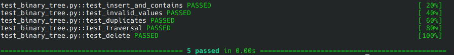

# Binary Tree: Recursive implementation in Python

## Description
This project implements a binary tree in Python, a fundamental data structure used to store comparable values.
It supports efficient insertion, deletion, and searching, as well as traversal methods (pre-, in-, and post-order).

## Table of contents
- [Features](#features)
- [Installation](#installation)
- [Usage](#usage)
- [Tests](#tests)
- [Project Goal](#project-goal)

## Features

This implementation supports the following methods:
- **Insertion**: Add comparable values (e.g., `int`, `str`, `float`) to the tree.
- **Duplicate Handling**: Duplicates are stored as right children of equal nodes.
- **Search**: Check if a value exists (`contains` method).
- **Deletion**: Remove nodes by value (`delete` method).
- **Traversal**: `pre-`, `in-` and `post-order` traversal (recursive).
- **Edge Case Handling**: Robust error handling for invalid inputs.
- **Utility Methods**: Print values or return them as a list.


## Installation
- No external libraries required. Tested on Python 3.12.3.

```bash
# clone the repository
git clone https://github.com/alejandrodorich/algorithms-datastructures.git

# Navigate to the Binary Tree folder (quotes are required because of spaces)
cd "algorithms-datastructures/Binary Tree"
```

## Usage

### Example:
```Python

from binary_tree import BinaryTree

bin_tree = BinaryTree() # create a new binary tree

# insert values into the tree
lst = [25, 17, 40, 19, 30, 8, 27, 45]

for num in lst:
    bin_tree.insert(num)
        
# delete a value from tree
bin_tree.delete(19)

# check if the tree contains a specific value
print(bin_tree.contains(17))

# create a list of values in pre-order
bin_tree.create_list_of_values("pre")

# print all values in post-order to the console
bin_tree.print_all_values("post")

```

## Tests
Tests are located in the `test_binary_tree.py` file and verify:
- Insertion and search functionalities.
- Presence of values using `contains`.
- Handling of invalid arguments.
- Insertion and deletion of duplicate values.
- Traversal methods (`pre`, `in`, `post`) and correctness of outputs.
- Creation of value lists.

Run tests with pytest:
```bash
pip install pytest
pytest -v test_binary_tree.py
```

Successful test output:


## Project Goal
This project demonstrates core object-oriented programming (OOP) principles and recursive algorithms, serving
as a foundation for understanding and implementing complex data structures.

