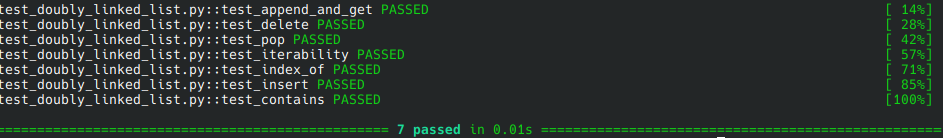

# Doubly Linked List: Iterative implementation in Python

This project provides a Python implementation of a doubly linked list, a fundamental data structure that allows efficient insertion, deletion, and traversal of elements. 
Each node in the list contains a reference to both its previous and next node, enabling bidirectional traversal.

## Table of contents
- [Features](#features)
- [Installation](#installation)
- [Usage](#usage)
- [Tests](#tests)
- [Project Goal](#project-goal)


## Features

This implementation of a **doubly linked list** provides the following core functionalities:
- **Insertion and Appending**:
  - `append(value)`: Add a value to the **end** of the list.
  - `insert(index, value)`: Insert a value at a **specific index**.
- **Deletion and Popping**:
  - `delete(value)`: Remove the **first occurrence** of a value.
  - `pop()`: Remove and return the **last value** in the list.
- **Search and Validation**:
  - `contains(value)`: Check if a value **exists** in the list.
  - `index_of(value)`: Find the **index** of a value.
- **Iterability**: Supports iteration via `for` loops (implements `__iter__`).
- **Size Tracking**: Track the list size using `len()` (implements `__len__`).
- **Error handling**: Robust error handling for invalid inputs, out-of-bounds indices or missing values.
  

## Installation
- No external libraries required. Tested on Python 3.12.3.

```bash
# clone the repository
git clone https://github.com/alejandrodorich/algorithms-datastructures.git

# Navigate to the Double Linked List folder (quotes are required because of spaces)
cd "algorithms-datastructures/Doubly Linked List"
```

## Usage

### Example:
```Python

from doubly_linked_list import DoublyLinkedList

# create a new doubly linked list
linked_list = DoublyLinkedList()

# insert values into the doubly linked list
lst = [25, 17, 40, 19, 30, 8, 27, 45]
for num in lst:
    linked_list.append(num)
        
# delete a value from doubly linked list
linked_list.delete(19)

# check if the doubly linked list contains a specific value
print(linked_list.contains(17))

# pop the last value out of the doubly linked list
popped_value = linked_list.pop()
print(f"The value popped is: {popped_value}")

# insert a value into a specific index in the doubly linked list
linked_list.insert(3, 55)

# print all values in the list to the console
print("Current values in list:")
for value in linked_list:
    print(value)

```

## Tests
Tests are located in the `test_doubly_linked_list.py` file and verify:
- Core methods: `insert`, `append`, `delete`, `pop`
- Value access methods: `index_of`, `contains`
- Verify iterability via `__iter__`
- Test error handling for invalid arguments:
    - Out-of-bounds indexes
    - Non-existing values
- Cover edge cases:
    - Operations on empty list
    - Deletion of head and tail nodes
    - Single-element list handling

Run tests with pytest:
```bash
pip install pytest
pytest -v test_doubly_linked_list.py
```

Successful test output:


## Project Goal
This project demonstrates core object-oriented programming (OOP) principles and iterative algorithms, serving
as a foundation for understanding and implementing complex data structures.

