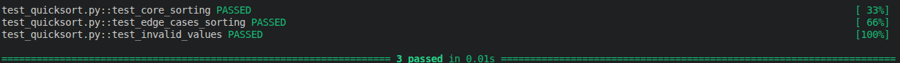

# Quicksort: Recursive implementation in Python

This project provides a Python implementation of Quicksort, a fundamental algorithm that allows efficient and fast sorting of lists. 

## Table of contents
- [Features](#features)
- [Installation](#installation)
- [Usage](#usage)
- [Tests](#tests)
- [Project Goal](#project-goal)


## Features

This implementation of **quicksort** provides the following core functionalities:
- **Efficient sorting**: `quicksort(lst: list) -> list` returns a new sorted list using the **in-place helper** (avg. time complexity: O(n log n),  worst case: O(n²))
- **Smart Pivot selection**: Uses median-of-three pivot selection (`_calculate_pivot_index`) to minimize worst-case scenarios (e.g. already sorted lists).
- **In place helper**: `_quicksort(lst: list, low_index: int, high_index: int)` for recursive sorting of sublists (internal use).
- **Error handling**: Robust validation for invalid inputs (raises `TypeError`).


## Installation
- No external libraries required. Tested on Python 3.12.3.

```bash
# clone the repository
git clone https://github.com/alejandrodorich/algorithms-datastructures.git

# Navigate to the Quicksort folder
cd "algorithms-datastructures/Quicksort"
```

## Usage

### Example:
```Python

from quicksort import quicksort

# define an unsorted list
test_list = [42, 8, 15, 47, 11, 17, 23, 4, 52, 84]

# sort the list with quicksort
sorted_list = quicksort(test_list)

# Output: [4, 8, 11, 15, 17, 23, 42, 47, 52, 84]
print(sorted_list)

```

## Tests
Tests are located in the `test_quicksort.py` file and verify:
- Core functionality of the sorting algorithm
- Standard cases:
    - Pivot initially at the beginning of the list
    - Pivot initially at the end of the list
    - Pivot initially at the center of the list
    - Already sorted list
- Edge cases:
    - List with duplicate, negative, and all-equal values
    - Two-element list
    - Empty list
    - Error handling for invalid arguments (non-list inputs)

Run tests with pytest:
```bash
pip install pytest
pytest -v test_quicksort.py
```

Successful test output:


## Project Goal
This project demonstrates core algorithmic and recursive programming principles, serving
as a foundation for understanding and implementing efficient sorting algorithms.

